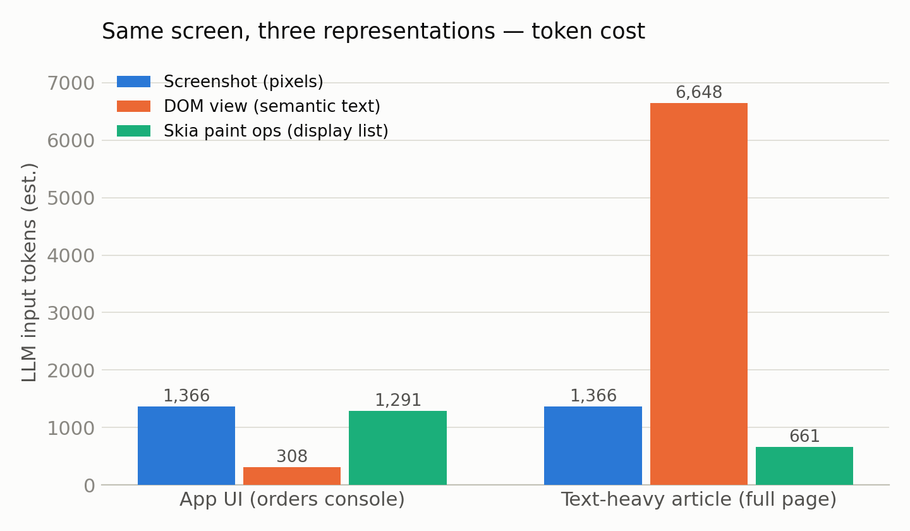
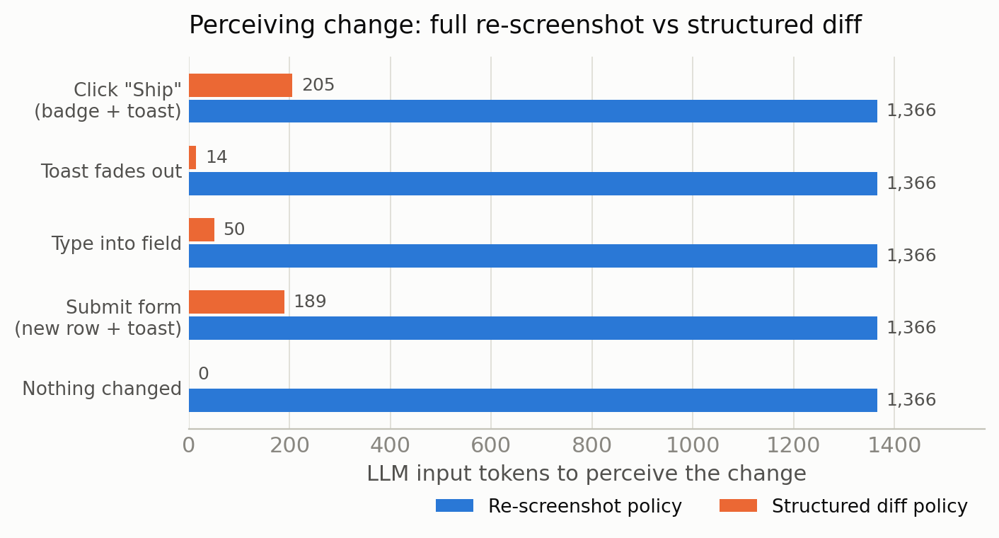
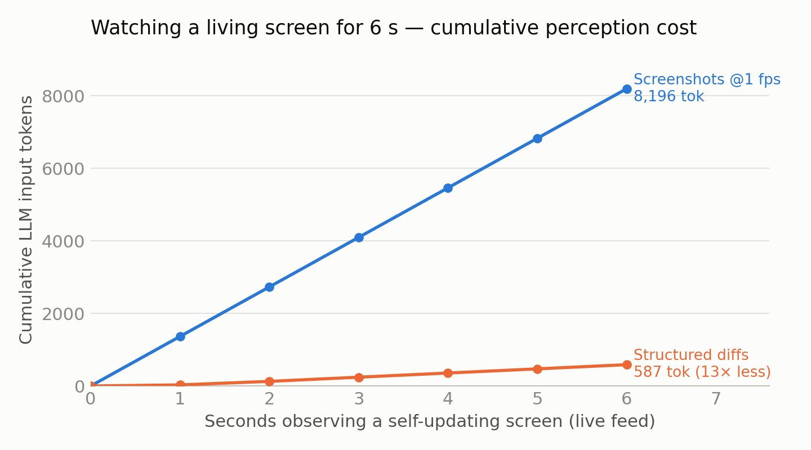

# pipeline-tap

**What if computer-use agents read the rendering pipeline's *input* instead of its *output*?**

Today's computer-use agents (Anthropic computer use, OpenAI CUA, Gemini Computer Use, UI-TARS) perceive the screen as the GPU's *output*: a screenshot per step, ~1,000–4,800 vision tokens each, re-interpreted from scratch every time — even when nothing changed. Yet the machine the agent runs on *forward-rendered* that screen milliseconds earlier from structured representations that still exist in memory: DOM, layout tree, display lists, draw commands. Screenshot perception is inverse graphics on a scene we already have the source for.

This PoC taps one rung of that pipeline — Chromium, via the Chrome DevTools Protocol — and measures what an agent would actually pay to *see* and to *watch* at each level:

1. **Screenshot** (pixels — the GPU's output)
2. **Distilled DOM/layout view** (semantic text: visible strings + interactive elements + boxes + live input values)
3. **Skia paint ops** (the display list — one rung above the GPU command stream)

## Findings

### 1. Same screen, three costs — and semantics evaporate on the way down



On an app-like UI, the distilled semantic view costs **308 tokens vs 1,366** for a screenshot (4.4× less), captures in **3–5 ms vs ~120 ms**, and covers the *whole page*, not just the viewport. On a text-heavy article the full-page DOM view costs more tokens than one screenshot — but it replaces the *N* scroll-screenshot steps needed to read the article, and never mis-OCRs a word.

The paint-op stream (display list) is the **semantic-evaporation exhibit**. The same screen region, three levels:

```
# DOM/layout view — text and affordances intact
text 422,190,105,19 "Dupont SARL"
button 1183,182,56,33 "Ship"
input 244,343,209,36 id=customer placeholder=Customer name value="Durand SAS"

# Skia paint ops (one level below) — geometry survives, content is gone
drawRRect {"left":244.5,"top":399.5,"right":1255.5,"bottom":443.5,...}
drawTextBlob @244,120 color=#FF000000   ← no string, not even glyph IDs
drawTextBlob @457.2,120 color=#FF000000

# GPU command stream (one level further) — textured quads over a glyph atlas
# (not even reachable via CDP; text was rasterized on the CPU before submission)
```

By the display-list level, `drawTextBlob` exposes position and color but **no text content whatsoever**. The literal "GPU input" is *below* this. The semantic sweet spot is above: the layout/render tree.

### 2. Perceiving *change*: diffs are 7–100× cheaper, and idleness is free



A screenshot policy pays 1,366 tokens to perceive any change — including no change at all. A structured-diff policy pays for what changed: 205 tokens for a click that reflows a table and pops a toast, 50 for typed text, 14 for a toast fading out, **0 when nothing happened**.

### 3. Watching a *living* screen



Screens change without the agent acting (feeds, toasts, progress bars — see LivingScreen, arXiv:2606.04701). Watching a self-updating feed for 6 s costs **8,196 tokens** under a 1 fps screenshot policy vs **587 tokens** as structured diffs (**14× less**) — and the diff stream is *event-shaped*: it tells the agent *what* changed without a frame-comparison puzzle. This is the event-camera argument transposed to the desktop: frames are a dense, redundant re-encoding of a change stream the compositor already computes (damage regions).

## Run it

```bash
npm install
node src/run-representations.mjs   # experiment 1: three representations
node src/run-diffs.mjs             # experiment 2: interaction diffs + living screen
python3 src/make-figures.py        # regenerate figures
```

Requires Chromium (uses `playwright-core`; set `executablePath` in `src/capture.mjs` if needed).

## Method notes & honest limitations

- Token estimates: images via Claude's documented formula (w×h/750); text at 4 chars/token. Not model-exact; relative magnitudes are the point.
- The distilled DOM view is deliberately simple (visible text, interactive elements, boxes, input values, opacity/visibility filtering). It already handles: typed values (`inputValue`), invisible-but-laid-out content (faded toasts). It does **not** yet handle: canvas/WebGL content (opaque at every structured level — the fallback is pixels), shadow DOM subtleties, cross-origin iframes, CSS-generated content.
- Layout reflow inflates diffs (a column resize re-emits its rows). Box-tolerant diffing would shrink diffs further; our numbers are therefore *conservative*.
- Screenshot capture time (~120 ms) is headless-Chromium-specific; the token cost is not.
- One browser, two synthetic pages. This is a probe, not a benchmark. The GTK4 (GSK render nodes) and Vulkan-layer (literal GPU stream, expected negative result) probes are the next rungs.

## Why this isn't just "use the accessibility tree"

It is adjacent — and the 1990s already ran this play: screen readers built "off-screen models" by hooking GDI/QuickDraw drawing calls, then the industry replaced them with semantic accessibility APIs. Two things are different now: (1) the render/layout tree *cannot lie or be missing* — it is what's on screen, by construction, whereas a11y trees are unmaintained exactly where agents need them most; (2) the consumer is no longer a brittle heuristic engine but an LLM, which is precisely a machine for interpreting heterogeneous structured noise. Whether that's enough is the question the paper takes up.

## Native probe (GTK4) — beyond the browser

`native/` taps a real GTK4 app (`gtk4-widget-factory`) at the exact moment it submits its scene to the rendering pipeline: `gsk_renderer_render()`. Findings, mirroring the browser results on a native toolkit:

- **Interception friction is real**: Ubuntu builds libgtk with `-Bsymbolic`, so the LD_PRELOAD shim (`gsktap.c`) cannot interpose intra-library calls — the capture uses a gdb-based tap (`tap.gdb`) instead. Production would use a toolkit hook or patched lib; the 1990s off-screen-model fragility story, replayed in miniature.
- **The captured tree is the whole screen, by construction**: `gtk4-rendernode-tool render` re-renders the intercepted tree into the exact on-screen frame (`native/samples/rerendered-frame.png`) — text, widgets, and even photos (texture nodes embed their bitmaps).
- **Text survives as glyph IDs** (`glyphs: 70 7, 82 8, ...`, post-shaping): recoverable with a one-time reverse-cmap per font (`decode_glyphs.py` decodes the samples to `"comboboxentry"`, `"Click icon to change mode"`). Ligatures/complex scripts would be lossy — the predicted "glyph problem", confirmed and mostly solvable.
- **Sizes** (widget-factory, 1332×751): 339 KB/frame serialized, of which 198 KB is embedded texture payloads (sendable once — stable identity) and 142 KB verbose structure (pre-distillation). **Inter-frame diffs: ~1–2 KB** while an animation runs — the same event-shaped economics as the browser probe.

## License

MIT
